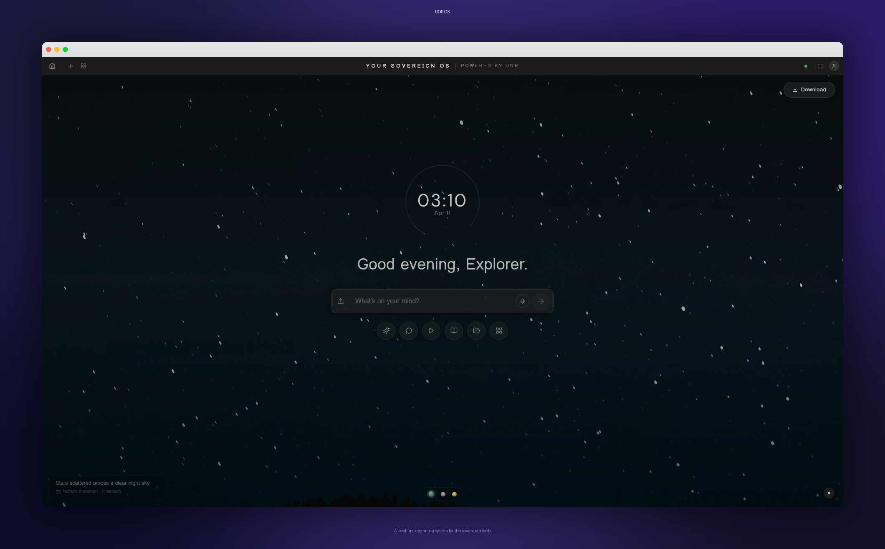

[](https://github.com/nicholasgriffintn/uor-os/actions)
[](LICENSE)
[](https://uor-os.lovable.app)
[](#platforms)
[](.github/CODE_OF_CONDUCT.md)

## Introduction

UOR OS is a local-first operating system that runs in the browser and ships as a native desktop application via [Tauri](https://tauri.app). It gives you a windowed desktop shell — complete with a dock, spotlight search, and theme engine — entirely within a single tab or as a standalone app on macOS, Windows, and Linux.

Every object in the system — files, messages, identities, computation results — is content-addressed and encrypted by default. Your data stays on your device, is cryptographically verifiable, and is portable across platforms. For a deep dive into the architecture, see [ARCHITECTURE.md](ARCHITECTURE.md).

## Getting Started

```bash
npm install    # peer deps resolved automatically via .npmrc
npm run dev    # opens at http://localhost:8080
```

For a native desktop build (requires the [Rust toolchain](https://rustup.rs)):

```bash
npm run tauri:build
```

## Features

- Windowed desktop shell with dock, spotlight search, and theme engine
- End-to-end encryption at rest and in transit with post-quantum key exchange
- Content-addressed identity for every object in the system
- Multi-model AI interface with epistemic grading and derivation proofs
- Encrypted messenger with forward secrecy
- Docker-compatible container runtime
- Knowledge graph with RDF triples and SPARQL queries
- Algebraic computation engine with independent verification

### Platforms

| Platform | Versions |
|----------|----------|
| Web | Chrome, Firefox, Safari |
| macOS | 11 and above (Apple Silicon and Intel) |
| Windows | 10 and above |
| Linux | Ubuntu 22.04+, Fedora, Arch |

## Contributing

We welcome contributions from everyone. Please read the [Contributing Guide](.github/CONTRIBUTING.md) before opening a pull request. For questions and discussion, open a [Discussion](https://github.com/nicholasgriffintn/uor-os/discussions).

All interactions in this project are governed by our [Code of Conduct](.github/CODE_OF_CONDUCT.md). If you discover a security vulnerability, please follow our [Security Policy](.github/SECURITY.md).

### Documentation

| Resource | Link |
|----------|------|
| Architecture Guide | [ARCHITECTURE.md](ARCHITECTURE.md) |
| Contributing Guide | [CONTRIBUTING.md](.github/CONTRIBUTING.md) |
| Security Policy | [SECURITY.md](.github/SECURITY.md) |
| Code of Conduct | [CODE_OF_CONDUCT.md](.github/CODE_OF_CONDUCT.md) |
| Changelog | [CHANGELOG.md](CHANGELOG.md) |

## Tech Stack

| Layer | Technology |
|-------|-----------|
| UI | React 18, Tailwind CSS 3, Radix UI |
| Build | Vite 5, TypeScript 5 |
| Desktop | Tauri 2 (Rust) |
| Crypto | AES-256-GCM, ML-KEM, SHA-256, Argon2id |
| Data | GrafeoDB (RDF), SPARQL, JSON-LD |
| AI | Multi-model gateway |
| Backend | Supabase (Edge Functions, Postgres, Storage) |

## Organization

UOR OS is an open-source project maintained by the community. Decisions are made through open discussion in issues and pull requests. Major architectural changes go through the RFC process documented in [CONTRIBUTING.md](.github/CONTRIBUTING.md).

## Licenses

Copyright 2024–2026 UOR OS Contributors. Licensed under [Apache License, Version 2.0](LICENSE).
